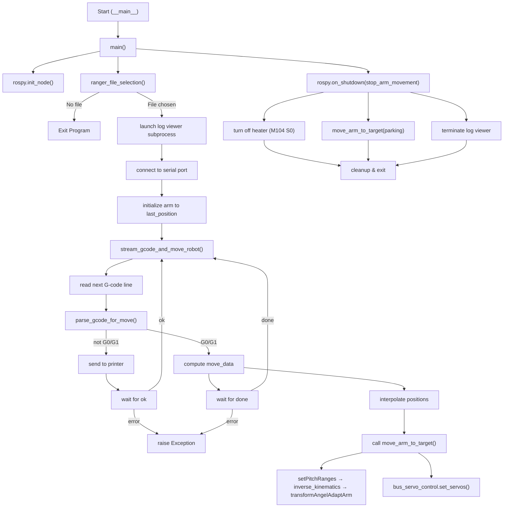
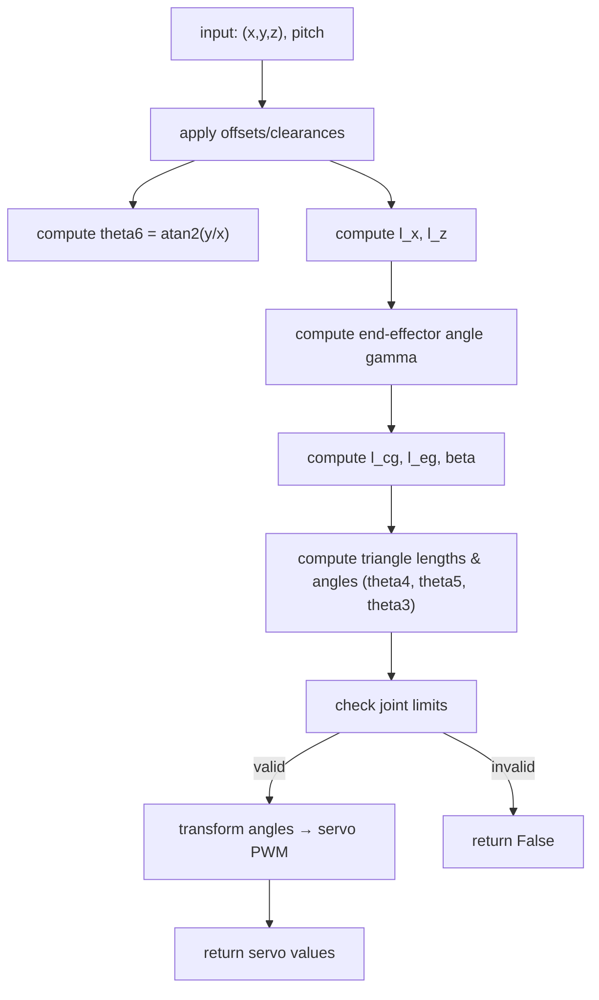

### Full Program Flowchart

### Separate IK Algorithm Diagram

[Main flowchart](https://mermaid.live/view#pako:eNptk9tu4jAQhl9l5IsVK1GWBLIULlZqS0_bUnVL1YuGKnITA1YTT2Q70AO93QfYR9wn2bFToK32AiSPP_8z82fmhaWYCTZg0xyX6ZxrC9fDiQLYiydsbN25kSQFlypJvk7YHezs_IB9unOhhos4eN-HDyis0ZRPLamkTRQJfyKGjuBqJnQylblIjMhFaiVulYaOW10guPsVHMaHj9LCpcaZ5sU74oiuIZ2jEWoFR3HOK5XOIccZLKRYCg2mui81psIY_-rI5z-OU1SKUoJFMEJLnkOJ2nrk2CMnsSueLuSzAK4LR-bc2KREI12pnj3x7Cm1Y6wWvEhmzsaEqywpcCESjfdoN02devpnTGQGSjxaON5xPORSCU_89MQZ6ZVcG_EmN0Xt5TZC7nfm-1dIIu1vx8EKzoOYXMhcoaWWygrt2fPAa16R5pKThyQGE4YPE_YmduWF8GEFp9uj0Br1Cq5jzaURcPiYivKt623ydeKQ7CzKygrwTWfc8jp16FOPgtiXU2LOiVkbWH-QUV3eKKT6Up7ntQQZnlhMaO5mYuvfqNa7oD7tpbTp_MrNkIG_v_-AVAvhHHsgKwtuZVqHLY2ZoZaLPSLzvYyXdk8X79V-UeL7ytAM6gUmNBdWY96iDHXEbLK_dXMVfnQyQyW2Xnpm5WJrO8MPftb21Vtws9kTVImZVzbDpWoYi6Xv3xlRCGXX-W_8o3FAr2ylFeB0CnNBjmpojIJ2F8btT6ir9D920miRS7NPcCcmpUIq94m2--OJcQBfSM39dTx8G6e54KoqKSRoMe9Yk820zNjA6ko0WUFK3B3Zix9XZufUyoQNnF9iyqvckmXqlZ6VXN0iFuuXGqvZnA2mPDd0qkqaJTGU3G39BqEhF_oAK2XZoO8V2OCFPbJBJwxbnV7ve9iNgqAX7PaiJnuicL_VafeibrfX3g2joB-9Ntmzz9lu9cOo321H_SDYjYIoil7_AYFzoC8)

[IK flowchart](https://mermaid.live/view#pako:eNpNkd1um0AQhV9lNBeVI2EHzF-M1EpNHCdpVSkXlSoVomoLw08Lu2hZEv_Et32APGKfpMsSGt8sLOc7Z46GA6YiI4wwr8VTWjKp4Os64QAf4wQr3vYqgtnW2ln7MwvaSqVlgg8wn3-Ay5i1bb0Dkecdqe48rYlJxlPqHgb_pYGudEoqGh1DoEpSLID3wBTjy9nufHums97YdTyR9Y-tpY-9EddGvP4vEs_mlOeUKiGB8aImKFjTMANfG3hzkpQWQxTp86ceb6CNgW5Oq8lqTKqJF6rs4N2Y3MHMtPassb3_-nSn5jcm6jZOS0p_wy9RcQV11VRqXMLtID8_srrKnuEuVno_XS5kM6X__fMCHclHAfffvpw4Kv7q-RRLUr3ksGF1R4a4MyM_T8Jo13ivF48WFrLKMFKyJwsbkg0brngYnAnq8g0lGOnXjHLW1yrBhB-1rWX8uxDN5JSiL0qM8mGqhX2bMUXrihWSvSH6R5C8Ej1XGDlLE4HRAbcYuU64cMMwWHq-44TORehbuNOfg4Vrh_7qwnE823GD8Gjh3gy1F6ulv_Js33U93w7sYHX8BwlN1RE)