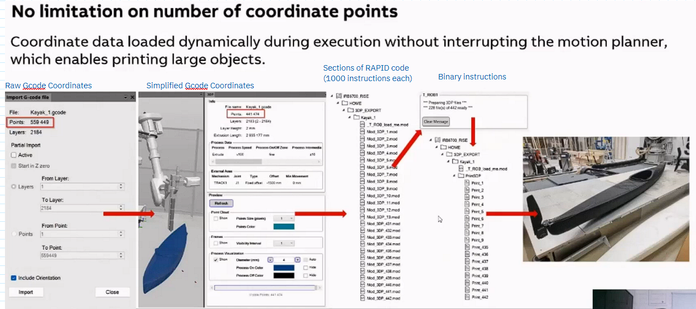
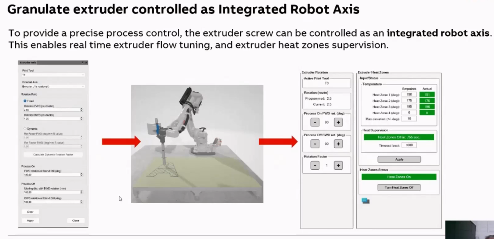
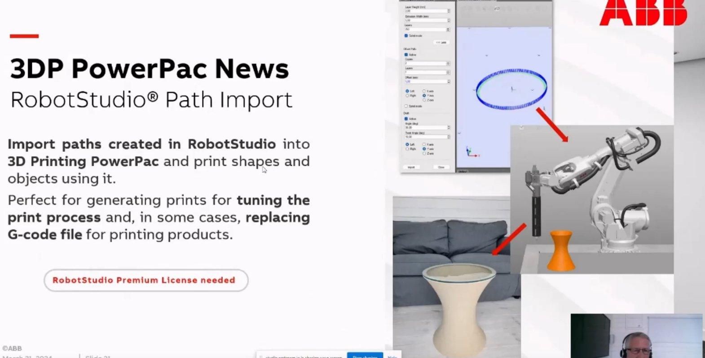

### Data Conversion in Module

### Extruder as Integrated Robot Axis

(For concrete printing) the rotation of extruder screw will have better synchronisation.

### Path Import and Printing without Gcode
