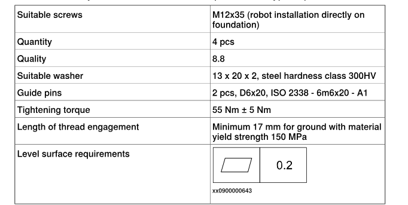

## Loads on foundation, robot

The illustration shows the directions of the robots stress forces.  
The directions are valid for all floor mounted, suspended and inverted robots.

#### Suspended Mounting

|Force|Endurance load (in operation)|Max. load (emergency stop)|
|---|---|---|
|**Force xy**|±910 N|±1620 N|
|**Force z**|+550 ±980 N|+550 ±1610 N|
|**Torque xy**|±570 Nm|±1550 Nm|
|**Torque z**|±280 Nm|±580 Nm|

## Requirements, foundation

The table shows the requirements for the foundation where the weight of the installed robot is included:

| Requirement                                    | Value      | Note                                                                                                                                                                                                                                                                                                                                                                                                                        |
| :--------------------------------------------- | :--------- | :-------------------------------------------------------------------------------------------------------------------------------------------------------------------------------------------------------------------------------------------------------------------------------------------------------------------------------------------------------------------------------------------------------------------------- |
| **Flatness of foundation surface**             | 0.1/500 mm | Flat foundations give better repeatability of the resolver calibration compared to original settings on delivery from ABB.  The value for levelness aims at the circumstance of the anchoring points in the robot base.  In order to compensate for an uneven surface, the robot can be recalibrated during installation. If resolver/encoder calibration is changed this will influence the absolute accuracy. |
| **Minimum resonance frequency**                | 22 Hz      | The value is recommended for optimal performance.  > **Note** > It may affect the manipulator life-time to have a lower resonance frequency than recommended.  Due to foundation stiffness, consider robot mass including equipment. ⁱ  For information about compensating for foundation flexibility, see the application manual of the controller software, section *Motion Process Mode*.           |
| **Minimum foundation material yield strength** | 150 MPa    |                                                                                                                                                                                                                                                                                                                                                                                                                             |

---

## Welding Screen (PVC curtains with frame)

### Option 1. SKYSHALO Welding Screen w/Frame, 6 ft. x 6 ft. Welding Curtain Screen Flame-Resistant Vinyl Welding Protection Screen on 4 Wheels

[HomeDepot Link](https://www.homedepot.com/p/SKYSHALO-Welding-Screen-w-Frame-6-ft-x-6-ft-Welding-Curtain-Screen-Flame-Resistant-Vinyl-Welding-Protection-Screen-on-4-Wheels-DMSHJPF6X6YCSUE9VV0-0731/331969207?source=shoppingads&locale=en-US#overlay)

#### 56 USD / Panel

#### Product specification

Internet # 331969207

Model # DMSHJPF6X6YCSUE9VV0-0731

| Product Depth (in.)  | 70.67 in |
| -------------------- | -------- |
| Product Height (in.) | 77.64 in |
| Product Width (in.)  | 2.28 in  |

---
### Option 2. # VEVOR Welding Screen with Frame, 6' x 6' 3 Panel Welding Curtain Screens, Flame-Resistant Vinyl Welding Protection Screen on 12 Swivel Wheels (6 Lockable)

[on LOWE'S site ](https://www.lowes.com/pd/VEVOR-Welding-Tool/5015875803)

[on VEVOR site](https://www.vevor.com/welding-screens-c_10055/vevor-welding-screen-with-frame-3-panel-6-x-6-welding-curtain-screen-12-wheels-p_010468304860)

#### 130 USD / 3 Panels

#### Product specification

| Item Model Number        | XU-2314                |
| ------------------------ | ---------------------- |
| Color                    | Red                    |
| Protection Level         | 6- Level UV Protection |
| Main Material            | Flame-Retardant Vinyl  |
| Number of Segments       | 24                     |
| Net Weight               | 46.4 lbs / 21.06 kg    |
| Single Screen Dimensions | 6 x 6 ft / 1.8 x 1.8 m |

---

## Duct Fan

The air exhaust system in Lab 151 has independent ducts for both the fume hoods that can handle ~80 fpm (from visual inspection we assume the flow meters have 8 inch diameters)  which is roughly 28 cfm. There is another stack duct with the same 8 inch regulator that takes the room air from four different spots, one of which is being occupied by the aerosol machine. 

If we simplify the case by assuming each of these four exhaust openings is equally taking 7 cfm, the flow rate at the 6 inch opening would be 35.65 feet per minute, which is not capable for welding fume extraction. 

A typical 6" fume capture arm on the market usually provides >300 cfm flow rate to create a 5 feet capture zone, according to the product specifications published by Miller Electric Mfg. LLC.

Thus, we should include an inline booster fan in our exhaust duct design to ensure sufficient flow rate.

### Option 1. Suncourt Inductor 6 in. Corded In-Line Duct Fan

[HomeDepot Link](https://www.homedepot.com/p/Suncourt-Inductor-6-in-Corded-In-Line-Duct-Fan-DB206C/206584745)

#### 41.98 USD

- Single Speed motor with an 18-Gauge grounded cord
- Both UL 1995 and CSA listed
- 160 CFM free air
- Maximum boosted air 250 CFM
- Thermally protected class B motor with automatic reset thermal fuse. 30 Running Watts, 0.35 startup Amps, 120 VAC, 60 Hz.
- Engineered polycarbonate blade
- 6 ft. heavy duty SJT 3 conductor 18-Gauge grounded cord
- Corrosion-resistant galvanized metal

#### Product specification

Internet # 206584745

Model # DB206C

Store SKU # 1001598741

| Dimensions | |
| --- | --- |
| Product Depth (in.) | 6 in |
| Product Height (in.) | 6 in |
| Product Width (in.) | 6 in |
| Brand/Model Compatibility | Ductstat, Suncourt |
| HVAC application | All HVAC types |
| Pack Size | 4 |
| Product Weight (lb.) | 2 lb |

### Option 2. VIVOSUN 275 CFM 6 in. Inline Booster Duct Fan with Speed Controller for HVAC Exhaust Ventilation

[HomeDepot Link](https://www.homedepot.com/p/VIVOSUN-275-CFM-6-in-Inline-Booster-Duct-Fan-with-Speed-Controller-for-HVAC-Exhaust-Ventilation-WAL-VSV-IFB6/327483763)

#### 34.99 USD

- 275 CFM airflow
- Durable steel housing
- Variable speed controller
- Less than 35 dB noise level

#### Product specification

Internet # 327483763

Model # WAL-VSV-IFB6

| Dimensions | |
| --- | --- |
| Product Depth (in.) | 7.2 in |
| Product Height (in.) | 6 in |
| Product Width (in.) | 6 in |
| Amperage (A) | 0.33 A |
| Brand/Model Compatibility | None |
| Duct Type | 6" Round |
| Horsepower (hp) | 0.05 hp |
| HVAC application | Ventilation |
| Material | Steel |
| Maximum air flow (CFM) | 275 |
| Pack Size | 1 |
| Product Weight (lb.) | 3.16 lb |

### Option 3. SKYSHALO Inline Duct Fan, 6 in. 400 CFM with Variable Speed Controller, Quiet AC-Motor Ventilation Exhaust Fan for Booster

[HomeDepot Link](https://www.homedepot.com/p/SKYSHALO-Inline-Duct-Fan-6-in-400-CFM-with-Variable-Speed-Controller-Quiet-AC-Motor-Ventilation-Exhaust-Fan-for-Booster-XLGDFJYCHSAC6J5DVV1-250208/334751996)

#### 57.76 USD

- Provides a sufficient airflow of 400 CFM
- Low noise of 34 dB
- Manual knobs to adjust fan speed
- Includes hang-up slings, non-vibration rubber mats and straps for installation

#### Product specification

Internet # 334751996

Model # XLGDFJYCHSAC6J5DVV1-250208

| Dimensions                |                        |
| ------------------------- | ---------------------- |
| Product Depth (in.)       | 12 in                  |
| Product Height (in.)      | 8.4 in                 |
| Product Width (in.)       | 10 in                  |
| Amperage (A)              | 0.54 A                 |
| Brand/Model Compatibility | 6-Inch Inline Duct Fan |
| Duct Type                 | 6" Round               |
| Horsepower (hp)           | 0.08 hp                |
| HVAC application          | Ventilation            |
| Material                  | Copper                 |
| Maximum air flow (CFM)    | 400                    |
| Pack Size                 | 1                      |
| Product Weight (lb.)      | 6.3 lb                 |
| Returnable                | 90-Day                 |
| Voltage (volts)           | 110                    |

---

## Welding Fume Extraction Duct 
### 6 in. x 8 ft. Semi-Rigid Flexible Aluminum Duct

[HomeDepot Link](https://www.homedepot.com/p/Everbilt-6-in-x-8-ft-Semi-Rigid-Flexible-Aluminum-Duct-MFX68XHD/203626515)

#### 21.97 USD

- Features a maximum heat resistance of 435⁰ F
- All aluminum products are fire resistant
- Flexible to allow for ease of installation
- Semi-rigid product holds its shape to help improve airflow
- 6 in. of diameter and stretches to 8 ft. L

#### Product specification

Internet # 203626515

Model # MFX68XHD

Store SKU # 606639

| Dimensions             |          |
| ---------------------- | -------- |
| Product Depth (in.)    | 27.08 in |
| Product Diameter (in.) | 6.0 in   |
| Product Height (in.)   | 6.4 in   |
| Product Length (in.)   | 96 in    |
| Product Width (in.)    | 6.4 in   |
| Color                  | Silver   |
| Insulated              | No       |
| Material               | Aluminum |
| Pack Size              | 4        |

---

### 6 in. Galvanized Steel Worm Gear Clamp

[HomeDepot Link](https://www.homedepot.com/p/Everbilt-6-in-Galvanized-Steel-Worm-Gear-Clamp-MC6HD/203626509)

#### 4.47 USD

- Adjusts from 5-1/8 in. to 6-1/2 in.
- Can be used in all venting applications

#### Product specification

Internet # 203626509

Model # MC6HD

Store SKU # 599737

| Dimensions             |                  |
| ---------------------- | ---------------- |
| Product Depth (in.)    | 0.08 in          |
| Product Diameter (in.) | 6.0 in           |
| Product Height (in.)   | 6.12 in          |
| Product Length (in.)   | 0.25 in          |
| Product Width (in.)    | 6.12 in          |
| Color                  | Silver           |
| Insulated              | No               |
| Material               | Galvanized Steel |

### 6 in. Flexible Duct and Sheet Metal Connector Splice Collar

[HomeDepot Link](https://www.homedepot.com/p/Master-Flow-6-in-Flexible-Duct-and-Sheet-Metal-Connector-Splice-Collar-FC6/100396940)

#### 7.98 USD

- Used as a coupling between 2 sections of insulated flex duct
- Beaded for strength
- Easy installation with sheet metal screws
- Crimped on both sides for easy fit
- Always seal seams with code approved mastic or sealant (or duct tape)
- Features a maximum temperature rating of 390 degree F

#### Product specification

Internet # 100396940

Model # FC6

Store SKU # 812067

| Dimensions | |
| --- | --- |
| Product Depth (in.) | 6 in |
| Product Diameter (in.) | 6 in |
| Product Height (in.) | 5 in |
| Product Width (in.) | 6 in |
| Brand/Model Compatibility | Universal |
| HVAC application | All HVAC types |
| Material | Galvanized Steel |
| Product Weight (lb.) | 0.49 lb |

### 6 in. 90 Deg. Round Adjustable Elbow

[HomeDepot Link](https://www.homedepot.com/p/Master-Flow-6-in-90-Deg-Round-Adjustable-Elbow-B90E6/100062966)

#### 8.68 USD

- Adjustable to any angle through 90°
- 30-Gauge galvanized steel
- Commonly used on HVAC applications
- Crimped end for easy installation
- Sturdy galvanized steel construction
- Simple to adjust

#### Product specification

Internet # 100062966

Model # B90E6

Store SKU # 148733

| Dimensions | |
| --- | --- |
| Product Depth (in.) | 6 in |
| Product Diameter (in.) | 6 in |
| Product Height (in.) | 9 in |
| Product Width (in.) | 6 in |
| Bend Degree | Adjustable |
| Brand/Model Compatibility | Universal |
| Gauge | 30 |
| HVAC application | All HVAC types |
| Material | Galvanized Steel |
| Product Weight (lb.) | 0.875 lb |

---

## Fixture / Clamping

### 4 in. Flat Drill Press Vise

[HomeDepot Link](https://www.homedepot.com/p/OLYMPIA-4-in-Flat-Drill-Press-Vise-38-714/205149978)

#### 28.79 USD

- Hardened steel replaceable 4 in. wide jaw faces
- Malleable cast steel body with powder coat finish
- 4 hole reinforced base for fast, easy machine table adjustment
- Ideal for drilling, tapping, grinding, reaming, milling and other machine operations
- Machined spindle for smooth operation

#### Product specification

Internet # 205149978

Model # 38-714

| Dimensions              |            |
| ----------------------- | ---------- |
| Jaw Width (in.)         | 4 in       |
| Throat Depth (in.)      | 1 in       |
| Clamping Strength (lb.) | 30000      |
| Hand Tool Type          | Vise       |
| Individual/Set          | Individual |
| Jaw Capacity (in.)      | 4.5        |
| Material                | Steel      |
| Returnable              | 90-Day     |
| Tools Product Type      | Power Tool |

### 4 in. Light Duty Drill Press Vise

[HomeDepot Link](https://www.homedepot.com/p/Yost-4-in-Light-Duty-Drill-Press-Vise-LDPV-4/306059507)

#### 21.59 USD

- Lightweight and portable design for easy installation
- Cast iron construction ensures durability
- Textured jaws provide a secure grip
- Features a slotted base for easy installation and positioning
- 1,000 lbs. clamping pressure

#### Product specification

Internet # 306059507

Model # LDPV-4

| Dimensions | |
| --- | --- |
| Jaw Width (in.) | 4 in |
| Throat Depth (in.) | 0.85 in |
| Clamping Strength (lb.) | 1000 |
| Duty Rating | Light |
| Hand Tool Type | Vise |
| Individual/Set | Individual |
| Jaw Capacity (in.) | 4 in |
| Material | Cast Iron |
| Returnable | 90-Day |
| Swivel base | No |
| Tools Product Type | Hand Tool |
| Vise Type | Bench |