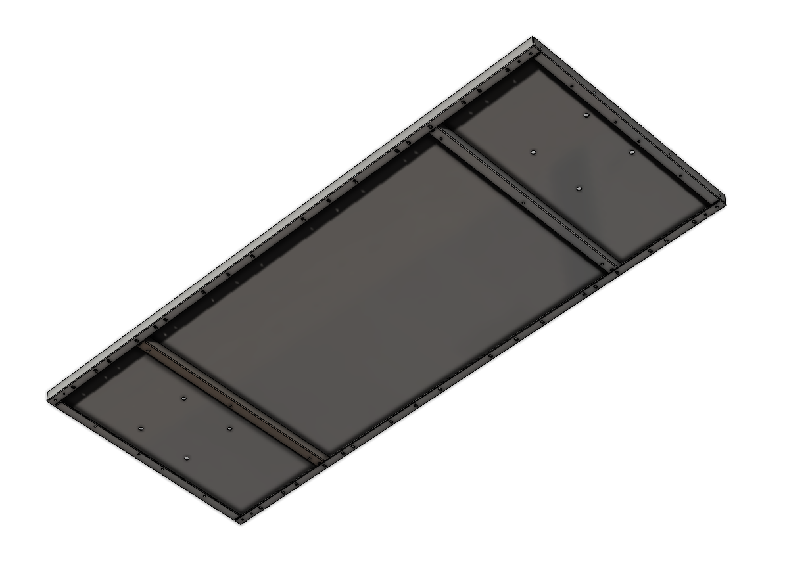
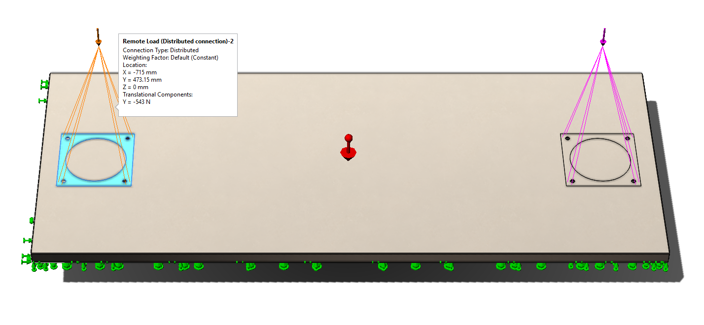
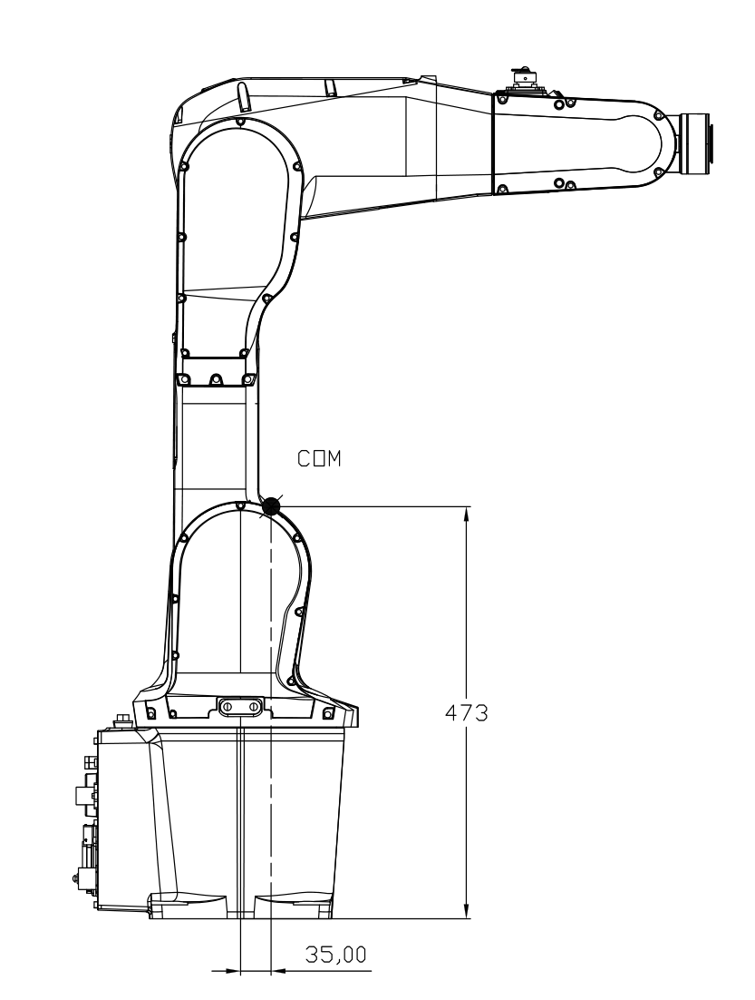
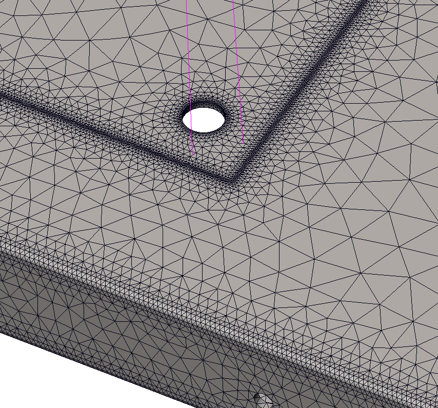
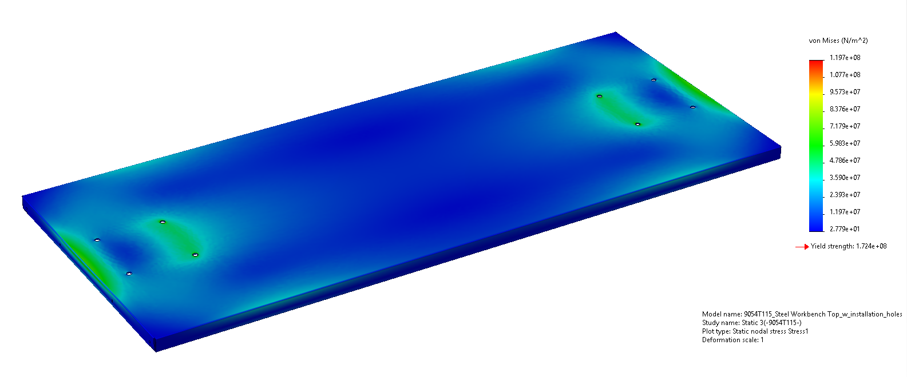
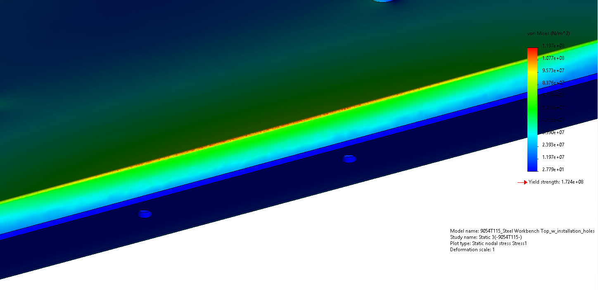
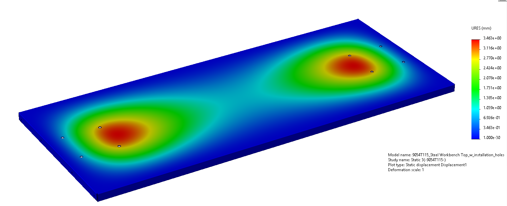
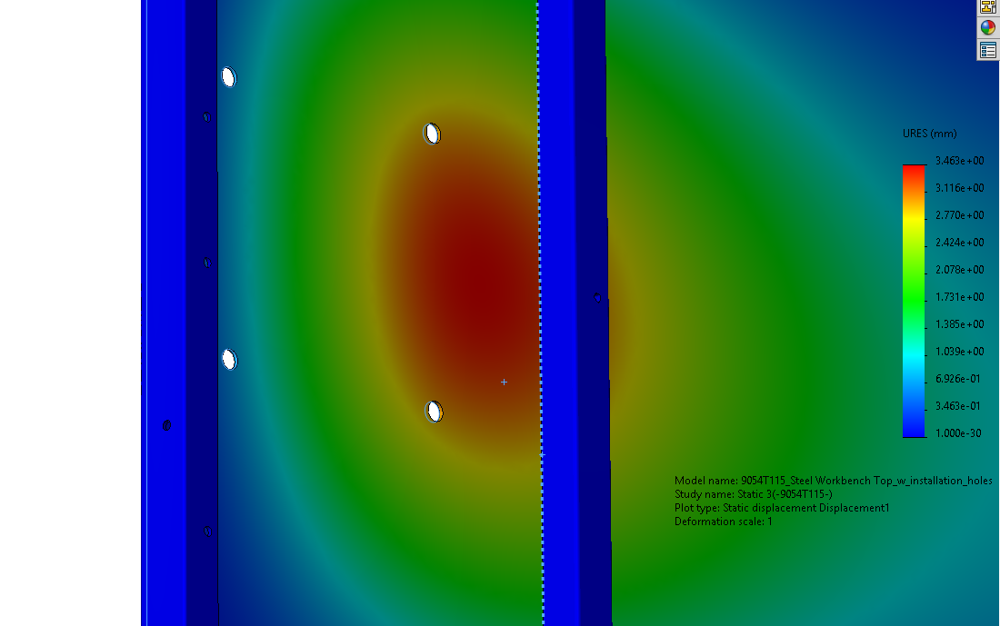
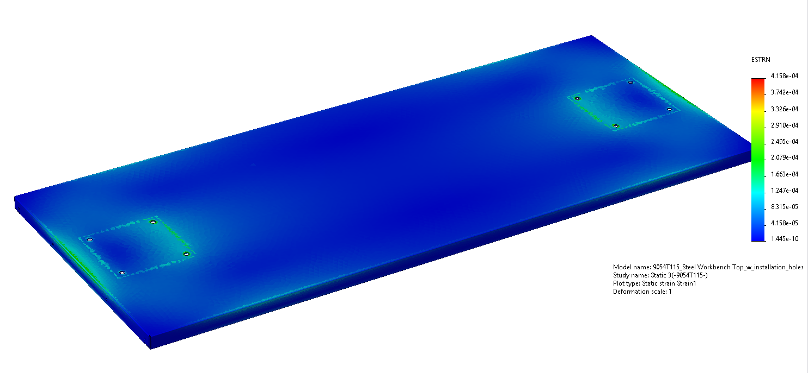
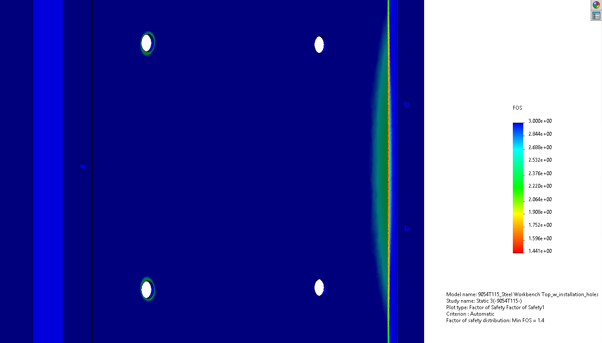

## Simulation Setup

### Geometry

The analysis utilized the CAD model of the [Steel Workbench Top, 72" Wide x 30" Deep](https://www.mcmaster.com/9054T115/) (McMaster-Carr P/N 9054T115). The geometry includes the main 12-gauge sheet metal surface and its underlying C-channel support braces as an assembly.

Technical Drawing

View from top

View from below, the support brace can be moved to different locations according to need.

### Material Properties

The specific grade of steel was not provided in the product documentation, which only specified stainless or powder-coated steel. Therefore, AISI 316 Stainless Steel was selected as a representative material for the analysis. The key properties are detailed below:

| Property         | Value       |
| ---------------- | ----------- |
| Elastic Modulus  | 193 GPa     |
| Poisson's Ratio  | 0.27        |
| Mass Density     | 8,000 kg/m³ |
| Yield Strength   | 172.4 MPa   |
| Tensile Strength | 580 MPa     |
|                  |             |

### Loads and Boundary Conditions

**Fixtures:** The flanged edges of the tabletop were fully fixed (`Fixed Geometry`) along their entire length. This boundary condition simulates a rigid, welded, or securely bolted connection to a heavy-duty workbench frame. This approach assumes the frame itself is substantially more rigid than the tabletop and undergoes negligible deformation under load.

**Loads:** The static weight of IRB1200-5-90 robot at `pos0` was applied. The total mass was calculated as 54.3 kg, resulting in a gravitational force of 532.7 N. To accurately represent the tipping moment created by the robot's center of mass (COM) — 473mm above the base with a 35mm horizontally apart form the centre line, the force of 543 N was applied from the remote COM point downwards and distributed across the robot's mounting footprints.

### Component Interaction

The physical connection between the support braces and the main tabletop surface involves threaded holes and short slots, which allow for adjustment. To simplify the model and reduce complexity, a direct bonded connection was defined for contacting surfaces. This assumes a perfect, rigid connection between the tabletop and support braces.

### Mesh Generation

A high-quality, blended curvature-based mesh was generated to discretize the model. To ensure the accuracy of results in areas with complex geometry or high-stress gradients, mesh control was applied to these locations where singularities likely to occur. This technique refines the element size around the mounting holes, the perimeter of the robot footprint, and all flanged edges where stress concentrations were anticipated. This local refinement is crucial for capturing peak stress values accurately.

- Total Nodes: 2,203,136

- Total Elements: 1,286,920

- Mesh Quality: 90.7% of elements had an Aspect Ratio below 3

## Results

### Static Study 1

#### Von Mises Stress

The analysis showed a maximum von Mises stress of **119.7 MPa**. This peak value is comfortably below the material's yield strength of 172.4 MPa, no permanent deformation or material failure is expected under the applied static load.

Stress concentrations are primarily observed along the front mounting footprint of the robot, where the moment from the COM exerts the most significant downward force. The absolute maximum stress value occurs at the inner side of the flange on the shorter edge of the tabletop.

#### Displacement

The maximum displacement from the simulation is **3.463 mm**. The deformation is not uniform; the surface across the robot's mounting patch tilts, ranging from approximately 3.4 mm at the front to 0.6 mm at the rear. This creates an incline of **0.729 degrees** at the robot's base. For a robot arm with a 900 mm reach, this angular displacement can be translated to **11.47 mm displacement at the tool tip**. This would be critical for precision applications.

Another observation from the CAD model is that the support braces are designed with a 3.4 mm clearance to the tabletop without initial contact. The simulation results show that under this load, the tabletop deflects just enough to make contact with these braces as shown below, which means the braces are not engaged to provide support until the maximum static load is applied.

#### Equivalent Strain

The maximum equivalent strain observed in the model was **4.158 x 10⁻⁴**. This value is well within the elastic region for stainless steel, deformation is temporary and the material is not at risk of permanent damage.

#### Factor of Safety

The minimum Factor of Safety for the assembly was calculated to be **1.44**. This was determined using the maximum von Mises stress criterion (FOS = Yield Strength / Max Stress). While it indicates the design is technically safe against failure under this specific static load, it was a relatively small safety margin, additional forces or torques from the robot's movement (dynamic or cyclic loads) could push the stress levels past the yield point.

### Conclusion

The FEA concludes that the 9054T115 workbench top is structurally capable of supporting the static weight of the IRB1200-5-90 robot without material failure. However, from a functional perspective, the tabletop's stiffness is inadequate. The significant displacement of up to 3.463 mm presents a critical concern for operational accuracy. The resulting tool tip deviation of over 11 mm would be unacceptable for robotic installation.

---

# Steel Beam Reinforcement 

* **Beam Type:** Two end fixed beam, rectangular cross section
* **Load (P):** 543 N (at the centre)
* **Length (L):** 30 inches = 0.762 m
* **Material:** 4140 Alloy Steel
	Modulus of Elasticity (E):
	    $E = 205 \text{ GPa} = 205 \times 10^9 \text{ Pa}$
	Yield Strength ($\sigma_y$):
	    $\sigma_y = 655 \text{ MPa} = 655 \times 10^6 \text{ Pa}$
* **Constraint 1 (Strength):** The maximum bending stress must not exceed the allowable stress.
* **Constraint 2 (Deflection):** Maximum deflection ($\delta_{max}$) at the centre must not exceed 0.2 mm.

### Safety Factor and Allowable Stress

* **Factor of Safety:** 2.0
* **Allowable Stress ($\sigma_{allow}$):**
    $\sigma_{allow} = \frac{\sigma_y}{FS} = \frac{655 \times 10^6 \text{ Pa}}{2.0} = 327.5 \times 10^6 \text{ Pa}$

### Beam Strength Equations

For a rectangular cross-section with width **W** and height **H**:
* **Moment of Inertia (I):**
    $I = \frac{WH^3}{12}$
* **Section Modulus (S):**
    $S = \frac{WH^2}{6}$
* **Maximum Bending Moment ($M_{max}$):** Occurs at the fixed ends.
    $M_{max} = \frac{PL}{8} = \frac{543 \text{ N} \times 0.762 \text{ m}}{8} = 51.72 \text{ N} \cdot \text{m}$
* **Maximum Deflection ($\delta_{max}$):** Occurs at the centre.
    $\delta_{max} = \frac{PL^3}{192EI}$

#### A. Strength Constraint Calculation

The bending stress must be less than or equal to the allowable stress.
$\sigma = \frac{M_{max}}{S} \le \sigma_{allow}$
$\frac{51.72 \text{ N} \cdot \text{m}}{WH^2 / 6} \le 327.5 \times 10^6 \text{ Pa}$
$WH^2 \ge \frac{6 \times 51.72 \text{ N} \cdot \text{m}}{327.5 \times 10^6 \text{ Pa}}$
$WH^2 \ge 9.48 \times 10^{-7} \text{ m}^3$

#### B. Deflection Constraint Calculation

The maximum deflection must be less than or equal to the 0.2 mm limit.
$\delta_{max} = \frac{PL^3}{192EI} \le \delta_{limit}$
$\frac{543 \text{ N} \times (0.762 \text{ m})^3}{192 \times (205 \times 10^9 \text{ Pa}) \times (\frac{WH^3}{12})} \le 0.0002 \text{ m}$
$WH^3 \ge \frac{543 \times (0.762)^3 \times 12}{192 \times (205 \times 10^9) \times 0.0002}$
$WH^3 \ge 3.65 \times 10^{-7} \text{ m}^4$

To find a specific solution, we assume a relationship **H = 2W** for a support beam.

1.  From the **strength** inequality:
    $W(2W)^2 \ge 9.48 \times 10^{-7} \implies 4W^3 \ge 9.48 \times 10^{-7}$
    $W^3 \ge 2.37 \times 10^{-7} \implies W \ge 0.00619 \text{ m}$
    $W \ge 6.19 \text{ mm}$

2.  From the **deflection** inequality:
    $W(2W)^3 \ge 3.65 \times 10^{-7} \implies 8W^4 \ge 3.65 \times 10^{-7}$
    $W^4 \ge 4.5625 \times 10^{-8} \implies W \ge 0.01462 \text{ m}$
    $W \ge 14.62 \text{ mm}$

To satisfy both conditions, we must choose the larger value for W, i.e.

* **Minimum Width (W):**
    $W = 14.62 \text{ mm}$
* **Minimum Height (H):**
    $H = 2W = 2 \times 14.62 = 29.24 \text{ mm}$

The required cross-sectional area ($A = W \times H$) is $14.62 \text{ mm} \times 29.24 \text{ mm} = 427.47 \text{ mm}^2$, meets the given condition. 

### Steel Bar Stock

Since the installation holes will be drilled to connect the robot base and table frame, the actual width should be the sum of the calculated width and largest hole diameter. Round up to 1-1/4 inch for convenience.

From McMaster, [1-1/4" Thick, 1-1/4" Wide, 36" Long Multipurpose 4140 Alloy Steel Bar](https://www.mcmaster.com/8910K68/) costs $96.48 Each, while an equivalent low-carbon steel bar costs $83.17 each. This suggests that a sheet metal tabletop with reinforcement would not be an economical alternative, as the total cost would exceed **$660 USD**.