### Working Range of IRB1200-5/0.9

To effectively design a robotic work cell, first we need to understand the robot's operational workspace, or working envelope as it is called in ABB's software. This analysis begins by examining the standard working range of the ABB IRB1200-5/0.9 robot and then investigates how this range is modified by the attachment of a wire arc welding gun.

##### Working Range without Tools

The manufacturer's specifications provide the baseline working envelope for the robot arm without any tool attached. The diagrams below illustrate the individual joint ranges and the resulting reachable positions at the wrist centre point (tool flange plate).

**Joint Ranges**
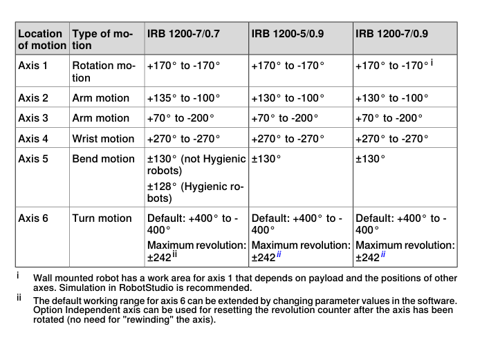

**Positions at Wrist Centre Point (Tool Flange)**
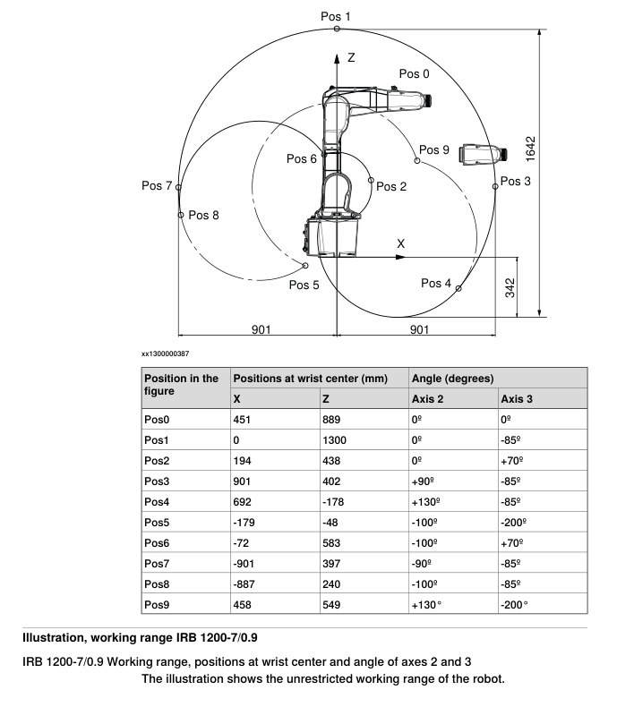

---

##### Working Envelope with Welding Gun Attached

The theoretical working range is significantly altered when a tool is mounted. For this study, the **ABB IRB1200-5/0.9** is equipped with an **ABB AW_Gun_PSF_25**. The geometry of this tool directly influences the final reach and orientation capabilities of the Tool Center Point (TCP).

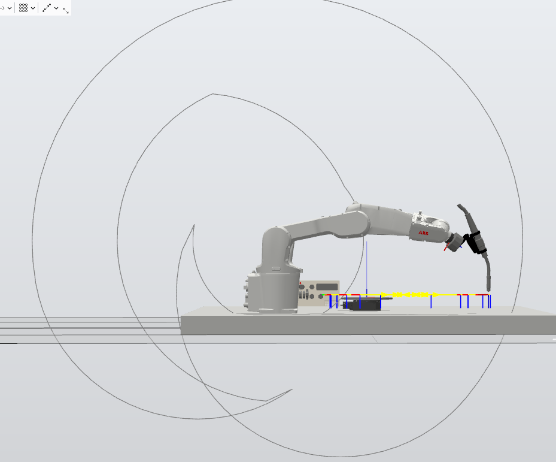

#### PSF 25 Tool Properties

The tool's geometry is defined by its translation and rotation relative to the robot's tool flange.

###### Transformation Matrix

The position and orientation of the TCP relative to the tool flange can be represented by a transformation matrix. The key components are:

* **Translation Vector:** The TCP is displaced from the flange origin by the following vector:

$$
\text{Translation} = [125.801, 0, 391.268] \text{ (in mm)}
$$

* **Rotation Matrix:** The tool's orientation is rotated relative to the flange.

$$
\text{Rotation} =
\begin{bmatrix}
0.898794 & 0 & 0.438371 & 0 \\
0 & 1 & 0 & 0 \\
-0.438371 & 0 & 0.898794 & 0 \\
0 & 0 & 0 & 1
\end{bmatrix}
$$

    This transformation corresponds to a **+52° rotation about the flange's Y-axis** from the default orientation.

###### Implication for the Wrist Joints

This built-in 52° angle has significant consequences for the behavior of the wrist joints (J4, J5, and J6), especially when trying to maintain a specific TCP orientation, such as pointing vertically downwards.

* **J5 (Tilt):** This joint must constantly compensate for the tool's 52° offset. To point the TCP straight down, J5 must set the flange at a precise inclination. As a result, for many common tasks, the J5 axis will operate near a fixed value corresponding to the required torch tilt.

* **J4 (Wrist) and J6 (Turn):** These two joints must now work in tandem to control the yaw (rotation about the vertical Z-axis). Any rotation required at the TCP is distributed between J4 and J6 to cancel out yaw introduced by the linear motion of the main robot arm.

While ABB's motion solver attempts to keep the wrist away from singularities (configurations where joint axes align, causing a loss of degrees of freedom), the non-straight tool geometry places additional strain on this process. To maintain a given posture, J4 often has to perform a significant amount of rotation. Observations in RobotStudio simulations show that during linear movements, J4 can accumulate rotation in one direction. If this cumulative angle exceeds its mechanical limit of $\pm400^\circ$, subsequent positions are reported as unreachable.

To quantify this effect, a simulation was performed where the IRB1200 scans linearly through points in the X-Z plane at a fixed height. The tool's Z-axis rotation was incrementally increased to map the reachable range and identify configurations close to singularity.

---

#### Reachability Analysis at Z=200mm

The following tests were conducted at a fixed height of 200 mm from the robot's base frame, with the tool always pointing vertically downwards but with varying degrees of rotation around the Z-axis.

##### **Position 1: Z Rotation 0°**
With the tool pointing vertically down, the baseline reachable range is established.

| Printing Platform Level (from robot base frame) | 200 mm |
| :---------------------------------------------- | :--- |
| TCP Orientation (RX, RY, RZ) in degrees         | -180, 0, 180 |
| Reach Distance (min)                            | 473 mm |
| Reach Distance (max)                            | 1180 mm |

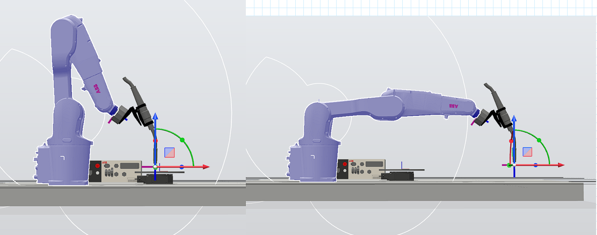

##### **Position 2: Z Rotation 15°**
A small rotation of 15° slightly alters the reachable area.

| Printing Platform Level (from robot base frame) | 200 mm |
| :---------------------------------------------- | :--- |
| TCP Orientation (RX, RY, RZ) in degrees         | -180, 0, 165 |
| Reach Distance (min)                            | 450 mm |
| Reach Distance (max)                            | 1168 mm |

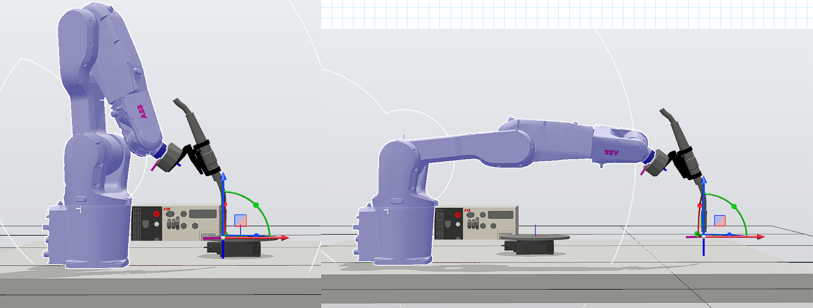

##### **Position 3: Z Rotation 30°**
As rotation increases, the maximum reach begins to shrink significantly. A singularity is encountered at the far end of the workspace.

| Printing Platform Level (from robot base frame) | 200 mm |
| :---------------------------------------------- | :--- |
| TCP Orientation (RX, RY, RZ) in degrees         | -180, 0, 150 |
| Reach Distance (min)                            | 404 mm |
| Reach Distance (max)                            | 872 mm |

*Note: Joints J4 and J5 reached a singular point during the transition to X=872mm.*
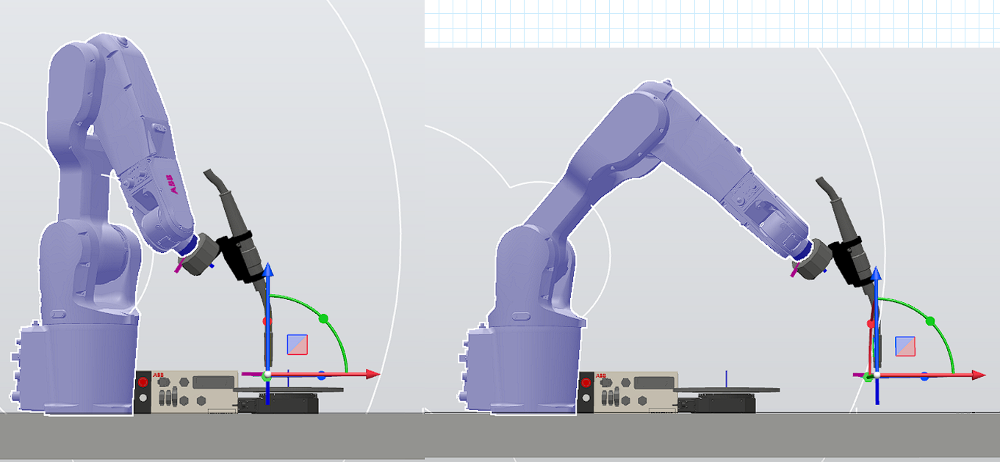

##### **Position 4: Z Rotation 45°**

| Printing Platform Level (from robot base frame) | 200 mm |
| :---------------------------------------------- | :--- |
| TCP Orientation (RX, RY, RZ) in degrees         | -180, 0, 135 |
| Reach Distance (min)                            | 320 mm |
| Reach Distance (max)                            | 1072 mm |

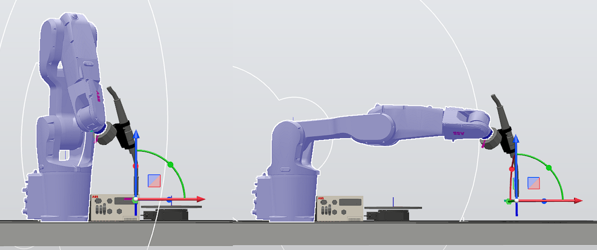

##### **Position 5: Z Rotation 60°**

| Printing Platform Level (from robot base frame) | 200 mm |
| :---------------------------------------------- | :--- |
| TCP Orientation (RX, RY, RZ) in degrees         | -180, 0, 120 |
| Reach Distance (min)                            | 245 mm |
| Reach Distance (max)                            | 1005 mm |

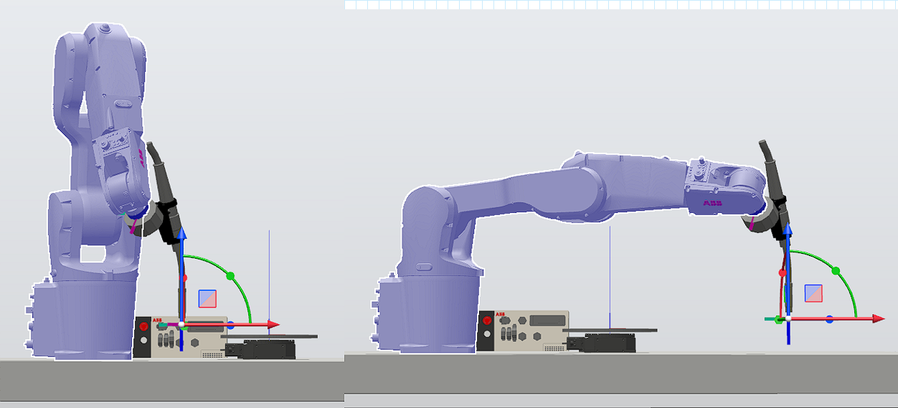

##### **Position 6: Z Rotation 75°**

| Printing Platform Level (from robot base frame) | 200 mm |
| :---------------------------------------------- | :--- |
| TCP Orientation (RX, RY, RZ) in degrees         | -180, 0, 105 |
| Reach Distance (min)                            | 250 mm |
| Reach Distance (max)                            | 930 mm |

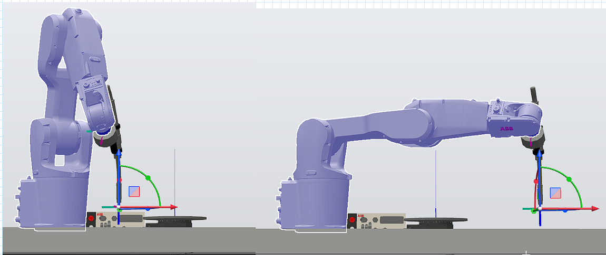

##### **Position 7: Z Rotation 90°**
At a 90° rotation, the maximum reach is further reduced.

| Printing Platform Level (from robot base frame) | 200 mm |
| :---------------------------------------------- | :--- |
| TCP Orientation (RX, RY, RZ) in degrees         | -180, 0, 90 |
| Reach Distance (min)                            | 250 mm |
| Reach Distance (max)                            | 852 mm |

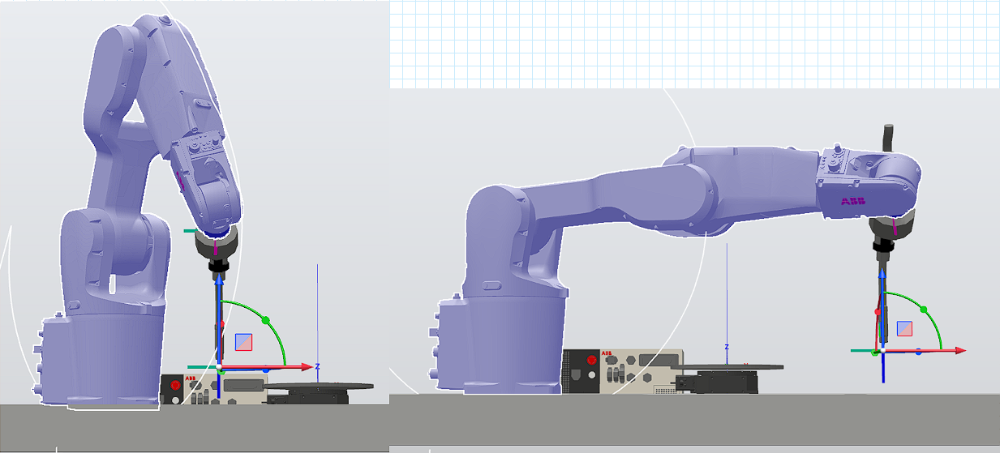

---

#### Conclusion on Reachable Range at Z=200mm

The analysis demonstrates that as the required tool rotation about the Z-axis increases, the reachable workspace shrinks, particularly the maximum reach. The following graph summarizes the minimum and maximum reach distances observed for each tool angle tested.

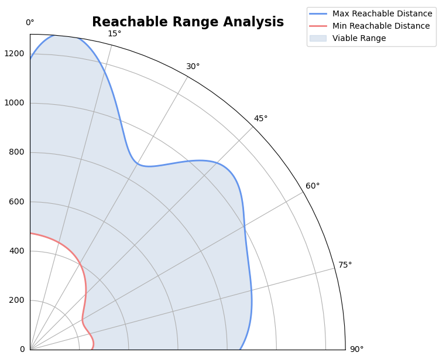

To ensure robust operation across a wide range of tool orientations without encountering singularities or joint limits, a conservative yet versatile working range must be selected. Based on the data, a radial distance of **500 mm to 800 mm** from the robot's base is identified as a reliable operating range. This zone provides accessibility for all tested tool angles from 0° to 90°.

---

### Layout Configuration

We can now evaluate potential physical layouts for a dual-robot work cell. The goal is to position two IRB1200 robots and a central build platform to maximize workspace overlap and efficiency. Two primary configurations are considered.

#### Plan A: Diagonal Placement

In this layout, two IRB1200 robots are mounted at opposite corners of the work table. The rotary stage and build platform are positioned at the geometric center, allowing both robots to access the workpiece from different angles. 

This configuration creates a large, shared work area, both robots can access the build platform from either side at different angles. With proper collision avoidance method, each of the robots should be allowed to reach any given point where the joint pos allows it.

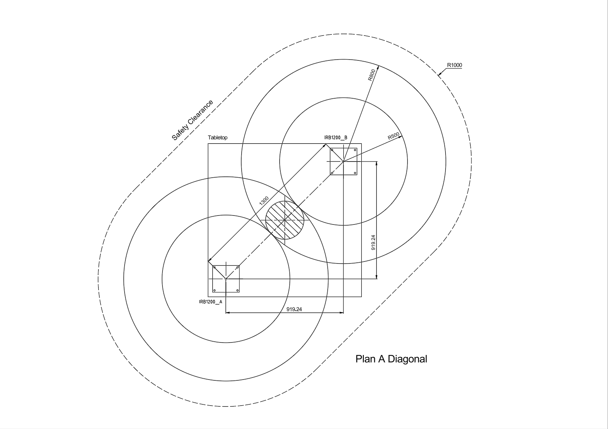

#### Plan B: Compact Placement

This layout places both IRB1200 robots along the same edge of the work table, with the rotary stage and build platform mounted on the opposite side. This arrangement is designed to minimize the overall footprint of the work cell, making it ideal for space-constrained places (i.e. our lab) and welding shield.

One major constraint of this layout is the fact that it limits the approach angle of the robot tool. One robot might be able to reach the other's half of workspace in some occasions and avoid contact, only when it keeps tilting and turning the tool to the direction of the other side. (in the figure below, that is right for robot_A and left for robot_B) The control system should always keep the position of IRB1200s' forearms in mind for preventing overlap. 

A more simpler approach would be just limit these two robots in their own half of the workspace and never allow them to cross the centre line. Obviously that will have a negative impact on the flexibility of task assignment and motion planning if one robot can only print in 1/2 of total build volume, but this disadvantage can be partially offset by the introduction of the rotary stage. The AM powerpac add-in can add the rotary stage as an additional axis and include it as part of motion control.
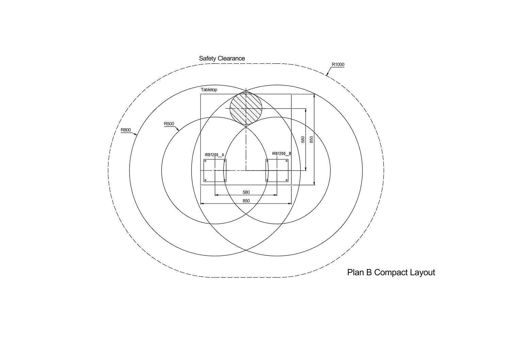

